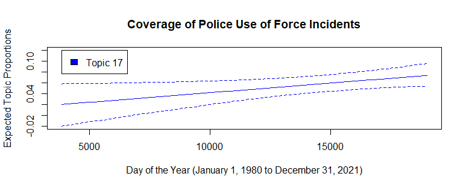

### Introduction

Police use of force (UoF) incidents are events where police officers use physical force/violence in their interactions with the general public and potential suspects. They range from small confrontations leaving minor injuries to the taking of someone's life and oftentimes involve weapons. More politicized and charged terms for these events include police brutality and police violence. From the beating of Rodney King in the 1990s, the shootings of Michael Brown and Philando Castile in the 2010s, and the recent deaths of George Floyd and Breonna Taylor, highly publicized police use of force incidents have repeatedly happened throughout the U.S.'s recent history. Furthermore, there is evidence to suggest that UoF incidents have been increasing over the years (GBD 2021). A corresponding line of inquiry to research on the prevalence of police UoF incidents is coverage of these incidents in the U.S. media. Lawrence's (2000) research on articles covering police UoF incidents in the New York and L.A. Times highlighted the importance of the U.S. media in framing police UoF incidents and influencing people's perception, knowledge, and disposition towards the way police interact with the public. While Lawrence's research was a worthwhile effort, the limited sample analyzed and time-intensive methodology used begs the question of whether there is a method to analyze media coverage of police UoF incidents more expediently. A possible process that might be employed is structural topic modeling, a supervised machine learning method. In this paper, I will try to employ structural topic modeling to yield results comparable to Lawrence's (2000).

Lawrence's (2000) research looked at approximately 500 articles covering police UoF incidents from the New York Times and L.A. Times. The method Lawrence used to analyze these articles was a social science methodology called content analysis. In content analysis, documents are coded by hand for codes/themes thought to be theoretically relevant. Examples of Lawrence's themes include the author mentioning a weapon being used by either the police or victim, a mention of the police officer's or victim's race/ethnicity, and a mention of a systemic claim of police violence by the author. While content analysis yields very rich and theoretically dense data for analysis, it is a time-intensive process that usually requires multiple, by-hand coders to converge on a similar set of codes across a large number of documents. Because of this, Lawrence's (2000) analysis of her articles only looked at 50 articles randomly sampled from her original sample of approximately 500. Furthermore, Lawrence's results and conclusion discussed media's coverage and framing of police UoF incidents broadly but did not talk about how these themes changed over time. While a machine learning approach like structural topic modeling towards this type of research would lose the richness of human-interpreted results afforded by content analysis, it would allow for analysis of a larger number of documents in less time and allow us to look at how themes have changed over time.

#### Conceptual Model and Hypothesis

To help move forward with data collection and analysis, I first outline a conceptual model for media coverage of police violence and a hypothesis for this paper. I use Lawrence's (2000) conclusions on the media's role in framing police use of force and concetemporary trends on police violence (GBD 2021) to inform my model and hypothesis. The general model is that the U.S. media, in the ways that they cover police UoF incidents, frames the way that the general public socio-emotionally perceive police and the way they interact with the public. This is accomplished by the way that members of the media write up specific incidents; ranging from neutral summaries of the event to the use of more critical language to document police actions. In coverage of police UoF incidents, I expect the media to be more critical over time and, in their coverage of these events, use words that are more politicized, critical, or emotionally charged in their write ups. Therefore, the formal hypothesis for this paper is:

*H1: Media coverage of police use of force incidents will be more critical over time*

The following section outlines the methods and materials used for analysis.

### Methods and Materials

#### Structural Topic Models

Structural topic models (STMs) are supervised machine learning models that use text and metadata about that text to look at the prevalence of words and phrases that hang together (i.e., topics). After a person specifies the number of topics (K) they would like the STM to identify and a threshold value for the model to converge at, the STM will algorithmically identify clusters of words (topics) that hang together in text documents.

#### Sample

The sample of text documents I used to run STMs on was a set of 726 articles from the New York Times between 1980-01-01 and 2021-12-31 downloaded from the NexisUni database. The NexisUni database is a repository that collects articles from a large number of media outlets both in the U.S. and abroad. The Boolean search terms I entered to obtain the sample were: police AND "United States" AND "use of force" OR "excessive force" which yielded approximately 2,800 results. I then further cleaned the sample by removing articles that mentioned the Iraq War, the 2019-2020 Hong Kong protests, and other international incidents and locations which brought the total count of articles down to around 731, five of which I removed because they had no date of publication. Thus, in total, I ended up with a final sample size of 726 articles from the New York Times on the subject of police excessive use of force. However, the final sample is still not perfect as it contains some articles covering international policing efforts by the United Nations and the Israel-Palestine conflict.

#### Methods

Using my sample of 726 articles, I first load them into R using the [LexisNexisTools](https://cran.r-project.org/web/packages/LexisNexisTools/index.html) package which imports all articles as well as their metadata into a tibble object. From there, I use the [quanteda](https://cran.r-project.org/web/packages/quanteda/index.html) package in R to process these articles into a document-term matrix (i.e., corpus) with stop words removed, stemmed tokens, and the inclusions of n-grams (i.e., phrases of words) between 2 and 3 words long. Afterwards, I analyze the corpus using the [stm](https://cran.r-project.org/web/packages/stm/index.html) package in R.

#### Model Selection

Using the stm package, I first perform initial diagnostics on STMs with varying topics to find an acceptable number of topics to specify for the model. I ran STMs between 5-15 topics, followed by 20, 30, 40, and 50 topic STMs and compared their diagnostic values graphically which I present in Figure 1.

Using this graph, I selected a 20-topic model based on the graphs that inspect the residuals and semantic coherence in relation to the number of topics specified. The residuals are a measure of how well each word is fitting to a topic based on its relationship with date while semantic coherence is a measure of how well words in each topic hang together (topics with higher negative values are less coherent). Using these two measures, it is evident that semantic coherence continually drops off after the 10-topic STM but residuals still continue to fit better past 10 topics. While residuals fit best between 30 and 40 topics, semantic coherence begins to substantially drop past 20 topics. Thus, I went with a 20-topic STM because it was the model where semantic coherence and the residuals seemed to be the most in balance with one another. The Lower Bound and Held-out Likelihood graphs show the expected positive relationship with number of topics.

After selecting a 20-topic model, I then complete 4 different runs of the STM and compare their semantic coherence and exclusivity scores to the results of 20 runs of a 20-topic STM that have been aggregated together. Exclusivity is a measure of how exclusive words are to a specific topic (higher exclusivity = words are more exlcusive to the topic). I represent this model selection process graphically in this scatterplot where the points are different topics from the 4 topics models ran and each color represents a different model (Figure 2).

Per the [stm package](https://scholar.harvard.edu/files/dtingley/files/jss-stm.pdf), I selected a model in which the scatter points plotted more to the upper-right side of the graph, or Model 3. Thus, Model 3, a 20-topic STM, is the model I chose for analysis. Finally, I checked the stability of the 20-topic STM over the 4 runs I did by plotting the semantic coherence across models with the expected number of documents and words shared (Figure 3 and 4).

 

 

While semantic coherence moves in the expected direction with number of words shared (topics that share more words are more coherent), it does not with number of documents shared (topics that share more documents are less coherent). However, the slope of this line is not very steep, indicating that the effect is slight and that the model is relatively stable for use. With the 20-topic STM inspected for diagnostics and stability, I now move to analysis of the model in the Results section.

### Results

Most of the topics from this stm are suitable for analysis based on the following figure measuring topic quality by plotting the semantic coherence and exclusivity of each topic in Figure 5.

 

While topics 9, 11, and 12 do fall off a bit in terms of their semantic coherence, most topics have acceptable (near average) exclusivity and remain coherent. Topics that are more specific in their convergence (e.g., converging on a specific case) will also have higher semantic coherence while topics that are more broad and describe more general coverage will be less coherent.

Figure 6 displays the probabilities of the top words and phrases for each topic. Common words throughout each topic are ones like "police", "officer", and "department". Topics 8 and 19 appeared to converge on national-level politics surrounding policing with words like "Republican", "Democrat", "Senate", and "Legislation". Topic 13, showing the imperfection of the sample, converged on words that describe international policing efforts commonly associated with the United Nations. Topics 11, 12, and 20 all converged on specific cases. Topics 3 and 16 converged on protest efforts surrounding police use of force incidents. However, using Lawrence's (2000) codes as guidance, Topic 17 appears to converge around the general topic of police use of force. Figure 7 displays the top words associated with Topic 17.

Words like "shoot", "shot", "kill", "gun", "death", "video", "black", "fatal", "force" lend evidence that this topic constitutes a politicized, racialized, and emotionally charged dimension of the New York Time's coverage of police use of force incidents. This topic does not consitute a specific event either, as example headlines from this topic include "When Police Call a Car a Weapon (2021)", "Kenosha Police Detail Run-up to Encounter (2020)", "Police Officer Charged With Murder in Killing of Handcuffed Suspect in Maryland (2020)", and "Victim Posed No Threat to Police, Family Says (2016)". Thus, this topic seemingly constitutes a broad dimension of how police use of force is covered by the New York Times. Using regression techniques, I then estimated the effect of the article's date of publication on the expected topic proportion. Figure 8 shows, over time, the expected topic proportions of topic 17 (*p\<0.05*).

 

Using this graph, the expected topic proportion of topic 17 at the initial time of article collection (1980-01-01) and the final time (2021-12-31) increases from approximately 0.03 to 0.05, a 200 percent increase. This helps show that the coverage of police use of force incidents by the New York Times has, over time, become increasingly charged.

### Discussion

Lawrence's (2000) research highlighted the important role the U.S. media plays in framing the general public's perception of police and the way they interact with them. The U.S. media plays a key role in shaping the information the general public gets about police use of force incidents. Thus, when the media uses more information, be it critical or not, the public is able to form a more coherent opinion. Over the years, the police's use of force on people has been seemingly increasing (GBD 2021) which has likely increased the media's coverage of these events. Using Lawrence's research as a guide, an interesting question to ask is whether the coverage of these events by the U.S. media has become more politicized, racialized, and/or emotionally charged. The idea is that as the public is continually exposed to police use of force incidents, they becoming increasingly critical of them, prompting increasingly critical coverage of them by the U.S. media. This study attempted to answer this question using the machine learning method of structural topic modeling. Not only are the results of the study worthwhile to research on police use of force and media framing of social movements and events, it also presents a useful method for analyzing text in social science research beyond the time-intensive, by-hand coding process of content analysis. However, the richness and density of results content analysis can provide relative to this study's methods are not to be discounted.

In this study, I found support for my initial hypothesis that the coverage of police use of force incidents by the New York Times has been seemingly increasing over time and become more critical. Structural topic modeling of New York Times articles on police use of force incidents demonstrated that words that are more politically, racially, and emotionally charged have been used more over time to cover these events.

However, this study is not without its limitations. First, the sample is not perfect and will yield more relevant results when cleaned more thoroughly. Second, a more in-depth analysis of this model would also likely compare similar topics to one another by leveraging diagnostic statistics that compare word associations both between- and within-topics. Third, the construction of time as a linear variable might not track on well to the actual relationship it has with police use of force coverage. A better construction of the variable might be a categorical one in which time is categorized by specific events. Fourth, this study only looked at the New York Times. While the New York Times is a good representation of what other local media outlets in the U.S. are covering, gathering a sample of articles from several media outlets would help to further validate the initial results from this study. And, finally, the search results I used to construct the sample heavily favored more recent articles, so the results displayed are partially a function of the sample of articles. However, the fact that the New York Times has more articles that cover police use of force incidents over time might lend support to the initial arguments of this study.

### Conclusion

Police use of force incidents are events that are increasing in the U.S. and that the media plays a large role in informing the general public about (Lawrence 2000, GBD 2021). Past research on media coverage of police use of force in the U.S. has generally used the time-intensive, by-hand coding method called content analysis. In this study, I looked to extend research on media coverage of police violence by identifying whether the media has become more critical of these events over time. Using the machine learning method structural topic modeling, I showed that the New York Times coverage of police use of force has become more politicized and racially and emotionally charged as words that carried these meanings converged into a topic in the STM and the topic was expected to increase over time. This study advances research on media coverage of police use of force incidents by both showing evidence of the effect of time while also identifying a less time-intensive method compared to content analysis that can yield comparable results.

### References

[GBD 2019 Police Violence US Subnational Collaborators. 2021. "Fatal police violence by race and state in the USA, 1980--2019: a network meta-regression". *The Lancet* 398(10307): 1239-1255](https://www.thelancet.com/journals/lancet/article/PIIS0140-6736(21)01609-3/fulltext)

[Lawrence, Regina G. 2000. "The Politics of Force: Media and the Construction of Police Brutality." Berkeley, CA: University of California Press](https://books.google.com/books/about/The_Politics_of_Force.html?id=m_v_TE13t9cC)
